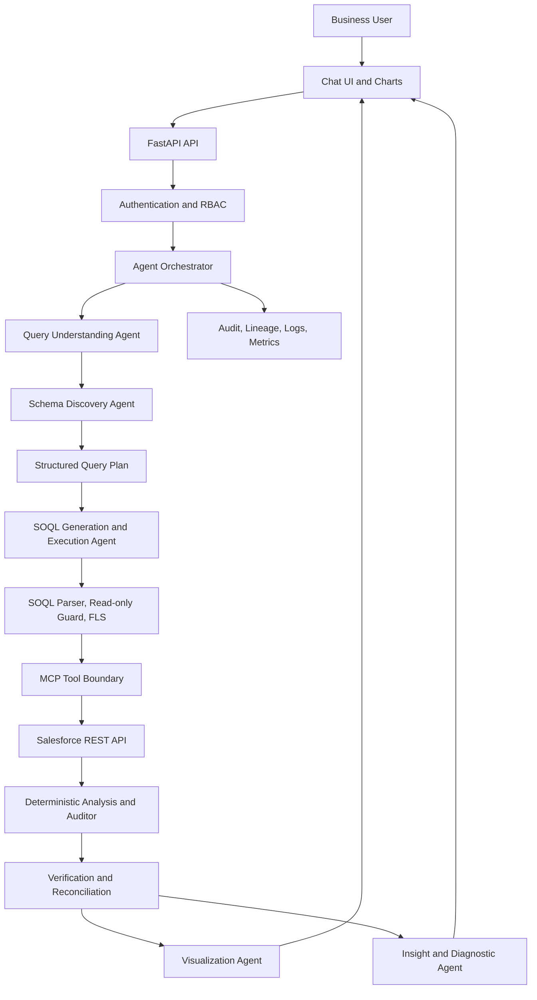
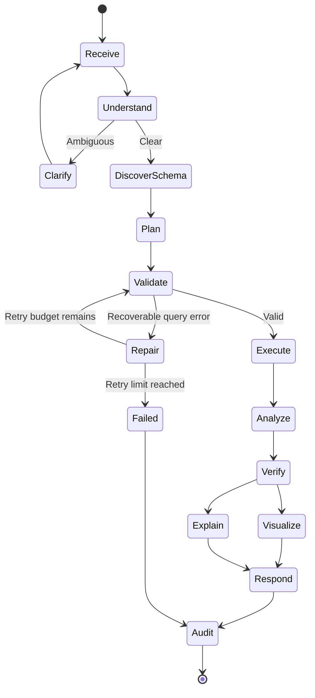

# Technical & System Design

## Architecture

## Agents
1. Query Understanding: extract intent, metrics, dimensions, filters, dates, ranking, comparison, and follow-up delta.
2. Schema Discovery: find permitted objects, fields, types, relationships, and FLS.
3. SOQL Generation/Execution: construct query plan, validate SOQL, execute only through guarded adapter, bounded repair.
4. Data Analysis/Auditor: deterministic aggregation, rankings, growth, conversion, and reconciliation.
5. Visualization: choose table/bar/line/pie and emit Plotly-compatible specification from verified data.
6. Insight/Diagnostic: explain verified outcomes; distinguish evidence from hypotheses.
7. Orchestrator: sequence agents, handle clarifications/errors/retries, preserve session state, emit audit events.

## Orchestration

## Contracts
AgentContext contains request/session/user/role, question, conversation state, and intermediate state. AgentResult contains success, structured data, errors, and provenance. Future contracts should include QueryPlan, AnalyticsResult, VisualizationSpec, and AuditEvent.

## MCP tool boundary
Proposed read-only tools: `describe_object`, `search_metadata`, `execute_soql`, `get_data_lineage`, `get_audit_trail`. Select and document the MCP framework/version during implementation.

## SOQL security
The included regex guard is a placeholder and is not production-grade. Before connecting to Salesforce, use a SOQL-aware parser or structured query builder; enforce object/field allowlists, FLS, read-only operations, query timeout, row limits, relationship restrictions, and safe literal/bind handling. Never weaken security during query repair. Proposed starting limits: 5-second query timeout and at most 3 repair attempts.

## Analysis and grounding
Use deterministic code and Decimal arithmetic for money, totals, ratios, ranking, and reconciliation. Handle nulls, duplicates, currencies, date boundaries, and time zones explicitly. Insights receive verified metrics and provenance only. Label uncertain causal explanations as hypotheses.

## Conversation
Persist metric, dimensions, filters, date range, comparison, ordering, limit, and chart type. A follow-up such as “Now only show the top 5” should change only ranking/limit and preserve relevant prior state.

## Security and observability
Use approved OAuth, least privilege, application RBAC plus Salesforce permissions, PII minimization/masking, secret management, rate limits, safe errors, audit retention, request IDs, agent timing, query fingerprints, and verification status. Never log access tokens or unmasked sensitive records.

## Cloud deployment
Choose Azure or AWS after confirming subscription, region, networking, and budget. Deploy containers behind HTTPS, use managed identity/roles and a secret manager, restrict outbound access, centralize logs/metrics, and document rollback. Cloud-specific IaC and deployment pipelines remain to be implemented.

## Open decisions
Salesforce auth model; target sandbox; LLM provider and data policy; MCP implementation; frontend; persistent session/audit store; business metric definitions; cloud provider/region and retention policy.
